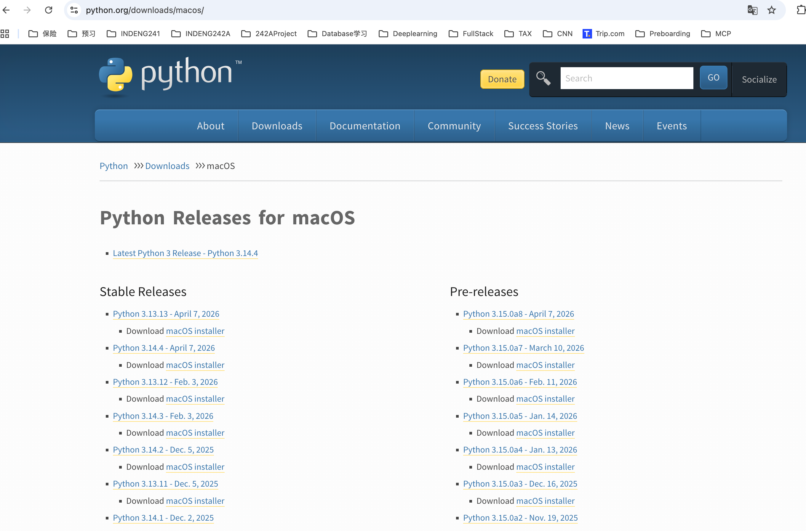
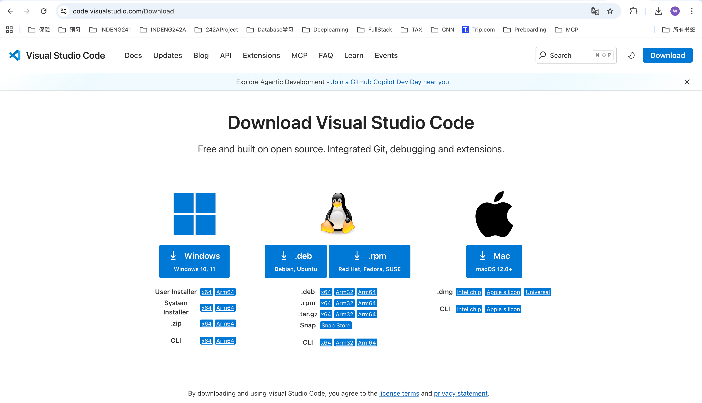
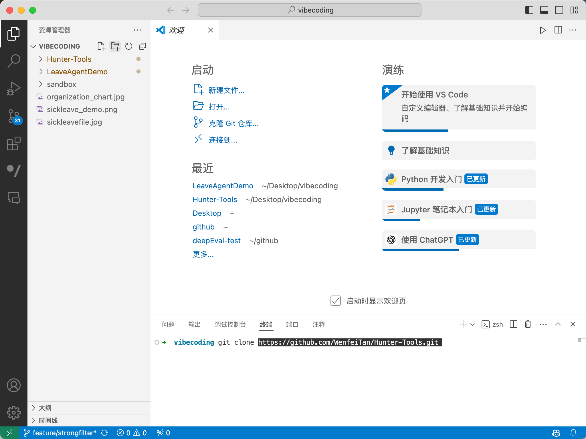
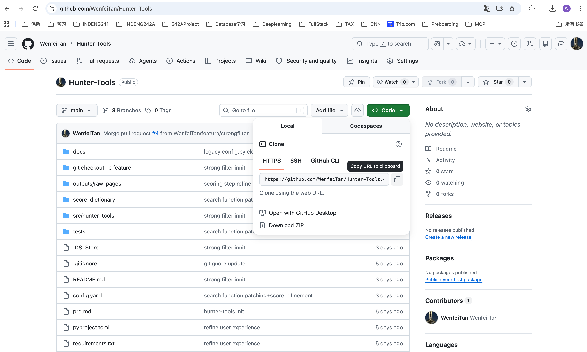
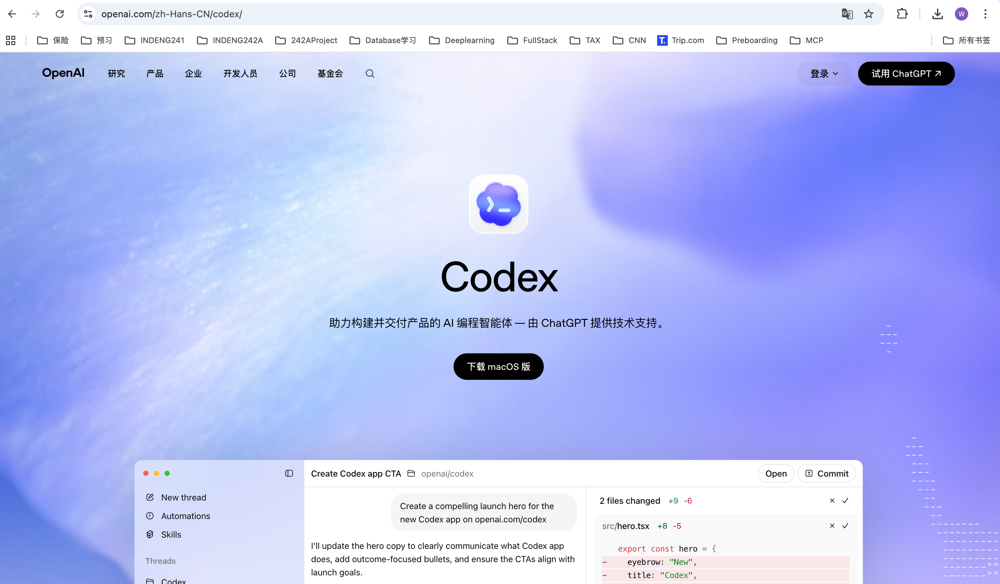
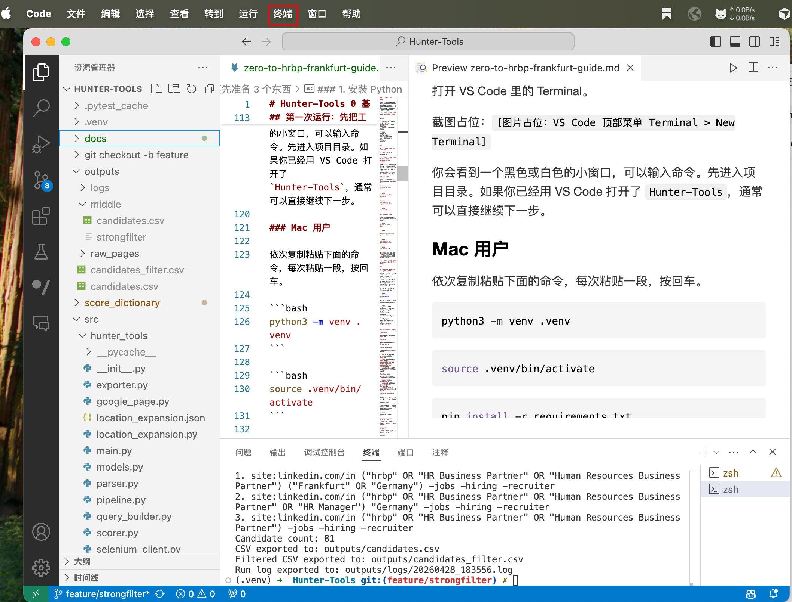
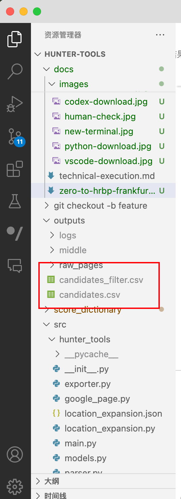

# Hunter-Tools 0 基础使用指南：从“我要找一个法兰克福 HRBP”开始

> 适合读者：没有 Python 基础、没有命令行经验，但想用这个工具自动搜集候选人线索的 recruiter / sourcer / hiring manager。
>
> 本工具的定位：帮你把重复的 Google X-Ray 搜索、LinkedIn 结果整理、关键词打分、CSV 输出自动化。它适合做候选人初筛线索列表，不替代人工判断、合规检查和候选人沟通。

---

## 这个故事从哪里开始

假设今天你接到一个需求：

> “我们要在德国法兰克福找 HRBP。最好有 Germany / Frankfurt 相关经历，懂 HRBP、HR Manager、Human Resources Business Partner 这类 title，能看到语言、年限、技能线索。不要让我一条条 Google 搜。”

手工做法通常是：

1. 打开 Google。
2. 输入 `site:linkedin.com/in HRBP Frankfurt Germany`。
3. 换 title 再搜一次。
4. 换 location 再搜一次。
5. 复制 LinkedIn 链接到 Excel。
6. 再自己看 title、简介、关键词。

Hunter-Tools 做的事情就是把这套重复动作变成一次命令：

1. 自动生成多条 Google X-Ray 搜索语句。
2. 自动打开浏览器抓 Google 结果。
3. 只保留 LinkedIn profile 链接。
4. 按 HRBP 词库给候选人打分。
5. 输出 `candidates.csv` 和强筛后的 `candidates_filter.csv`。

在 demo 里，`HRBP + Frankfurt` 这组搜索跑出了：

- 3 条搜索 query
- 81 条候选人线索
- 31 条命中强筛条件的候选人线索

---

## 你需要先准备 4 个东西

### 1. 安装 Python

Python 是运行这个工具的“发动机”。你不需要会写 Python，只需要安装它。



操作：

1. 打开 Python 官网。
2. 下载 Python 3.12.3。
3. 安装时，如果你用 Windows，请勾选 `Add Python to PATH`。
4. 安装完成后，打开终端检查：

```bash
python3 --version
```

如果你看到类似下面的内容，说明安装成功：

```text
Python 3.12.3
```

Windows 用户如果 `python3` 不生效，可以试：

```bash
python --version
```

---

### 2. 安装 VS Code

VS Code 是你打开项目文件、修改配置的地方。你可以把它理解成一个更适合代码项目的文档编辑器。



操作：

1. 打开 VS Code 官网。
2. 下载并安装。
3. 安装完成后打开 VS Code。

---

### 3. 下载 Hunter-Tools 项目代码

接下来要把这个工具的代码下载到你的电脑。你可以把它理解成“下载一个可以运行的小工具文件夹”。



你有两种方式：

#### 方式 A：熟悉 Git 的用户，用 `git clone`

如果你已经会用 Git，推荐用 clone。这样以后项目更新时，也更容易同步最新版本。

操作：

1. 打开项目代码页面。
2. 点击 `Code` 按钮。
3. 复制仓库地址。
4. 在 Terminal 里进入你想放项目的目录，比如 Desktop。
5. 运行：

```bash
git clone <这里粘贴仓库地址>
```

例如：

```bash
git clone https://github.com/your-name/Hunter-Tools.git
```

运行完成后，你会得到一个 `Hunter-Tools` 文件夹。

#### 方式 B：只想快速使用，直接 Download ZIP

如果你不熟悉 Git，或者只是想先把工具跑起来，推荐用 Download ZIP。这个方式最简单。

操作：

1. 打开项目代码页面。
2. 点击 `Code` 按钮。
3. 选择 `Download ZIP`。
4. 下载完成后，把压缩包解压。
5. 解压后你会得到一个文件夹，名字通常是 `Hunter-Tools`。
6. 把这个文件夹放在一个你容易找到的位置，比如 Desktop。

不管你用 `git clone` 还是 `Download ZIP`，下一步都一样：回到 VS Code，选择 `File > Open Folder`，打开 `Hunter-Tools` 文件夹。



---

### 4. 安装 / 打开 Codex

Codex 用来帮你理解、修改和维护这个工具。比如你可以让它帮你加一个新岗位词库、解释为什么某个候选人分数高、或者把指南改成英文版。



操作：

1. 安装并登录 Codex。
2. 打开同一个 `Hunter-Tools` 项目文件夹。
3. 确认左侧能看到这些文件：

```text
README.md
config.yaml
score_filter.yaml
score_dictionary/
src/
outputs/
```

---

## 第一次运行：先把工具装起来

打开 VS Code 里的 Terminal。



你会看到一个黑色或白色的小窗口，可以输入命令。先进入项目目录。如果你已经用 VS Code 打开了 `Hunter-Tools`，通常可以直接继续下一步。

### Mac 用户

依次复制粘贴下面的命令，每次粘贴一段，按回车。

```bash
python3 -m venv .venv
```

```bash
source .venv/bin/activate
```

```bash
pip install -r requirements.txt
```

```bash
pip install -e .
```

### Windows 用户

依次复制粘贴下面的命令，每次粘贴一段，按回车。

```bash
python -m venv .venv
```

```bash
.venv\Scripts\activate
```

```bash
pip install -r requirements.txt
```

```bash
pip install -e .
```

如果命令行最前面出现 `(.venv)`，说明你已经进入了这个项目自己的 Python 环境。


---

## 用故事跑一遍：我要找法兰克福 HRBP

现在我们进入真实任务。

你的招聘需求是：

> 我要找法兰克福附近的 HRBP 候选人，希望工具自动帮我搜 LinkedIn 公开结果，并按相关性排好。

最适合 0 基础用户的方式是交互式运行：

```bash
hunter-tools --interactive
```

工具会一个问题一个问题问你。你可以这样填：

```text
job_title: HRBP
location: Frankfurt
title_alias_mode: core
location_mode: expanded
location_expand_level: 2
search_args:
pages_per_query: 1
page_size: 10
output: outputs/candidates.csv
```

### 每个问题是什么意思

`job_title`

你要找的岗位。这里填 `HRBP`。

`location`

你要找的地点。这里填 `Frankfurt`。

`title_alias_mode`

工具要不要自动扩展职位叫法。

- `off`：只搜你输入的 title，例如只搜 `HRBP`。
- `core`：推荐。会搜 `HRBP`、`HR Business Partner`、`Human Resources Business Partner` 等核心别名。
- `broad`：更宽，会带来更多结果，也会有更多噪音。

`location_mode`

工具要不要扩展地点。

- `strict`：只搜 `Frankfurt`。
- `expanded`：推荐。会搜 `Frankfurt` 和 `Germany`。
- `country_only`：只按国家搜，结果更多但更泛。

`location_expand_level`

地点扩展的宽度。第一次建议填 `2`，比较平衡。

`search_args`

额外搜索词。第一次可以直接按回车留空。比如你以后想找会中文的 HRBP，可以填：

```text
Mandarin, Chinese
```

`pages_per_query`

每条 Google 搜索看几页。第一次建议 `1`，比较快。

`page_size`

每页抓多少条结果。第一次建议 `10`。

`output`

结果保存到哪里。默认用：

```text
outputs/candidates.csv
```

---

## 跑的时候你会看到什么

运行后，工具会打开浏览器，自动访问 Google 搜索结果。


如果 Google 出现人机验证，不要慌。因为 `config.yaml` 里默认开启了人工处理反爬：

```yaml
show_browser: true
manual_antibot: true
```


你只需要在浏览器里按提示完成验证，工具会等待你处理完，再继续跑。

跑完以后，终端会输出类似：

```text
Generated queries:
1. site:linkedin.com/in ("hrbp" OR "HR Business Partner" OR "Human Resources Business Partner") ("Frankfurt" OR "Germany") -jobs -hiring -recruiter
2. site:linkedin.com/in ("hrbp" OR "HR Business Partner" OR "Human Resources Business Partner" OR "HR Manager") "Germany" -jobs -hiring -recruiter
3. site:linkedin.com/in ("hrbp" OR "HR Business Partner" OR "Human Resources Business Partner") -jobs -hiring -recruiter
Candidate count: 81
CSV exported to: outputs/candidates.csv
Filtered CSV exported to: outputs/candidates_filter.csv
Run log exported to: outputs/logs/20260428_183556.log
```

这里最重要的是两行：

```text
CSV exported to: outputs/candidates.csv
Filtered CSV exported to: outputs/candidates_filter.csv
```

这说明候选人列表已经生成了。

---

## 打开结果：从 CSV 变成候选人工作表

在 VS Code 左侧找到：

```text
outputs/candidates.csv
outputs/candidates_filter.csv
```



你也可以用 Excel、Google Sheets 或 Numbers 打开 CSV。

### 先看哪个文件

建议先看：

```text
outputs/candidates_filter.csv
```

这是强筛后的版本。当前 demo 的强筛条件是候选人必须命中 `location`，也就是候选人的 title 或简介里出现了 `Frankfurt` 或 `Germany` 这类地点线索。

如果你想看完整池子，再打开：

```text
outputs/candidates.csv
```

### 每一列怎么看

`name`

工具从搜索结果标题里猜出的候选人姓名。

`score`

相关性分数。越高越应该优先看。

`location_guess`

工具从简介里猜到的地点，例如 `Frankfurt` 或 `Germany`。

`yoe_guess`

工具从简介里猜到的工作年限。不是每个人都有。

`matched_keywords`

这个人为什么得分。比如：

```text
title:HRBP, location:Germany, language:German, seniority:HRBP
```

这列非常重要。它不是只告诉你“分高”，而是告诉你“为什么分高”。

`profile_url`

LinkedIn profile 链接。你后续可以点进去人工确认。

`title`

Google 结果标题。

`snippet`

Google 结果摘要。很多初筛线索都来自这里。

`source_query`

这个候选人是从哪条搜索语句里来的。以后复盘搜索策略时很有用。

---

## 怎么判断一次搜索是成功的

你可以用 3 个问题检查：

### 1. 候选人数量够不够

如果 `Candidate count` 很少，例如少于 10：

- 把 `location_mode` 从 `strict` 改成 `expanded`。
- 把 `title_alias_mode` 从 `off` 改成 `core` 或 `broad`。
- 把 `pages_per_query` 从 `1` 改成 `2`。

### 2. 结果是不是太泛

如果很多候选人都不在目标地区：

- 优先看 `candidates_filter.csv`。
- 在 `score_filter.yaml` 里开启更严格的强筛。

例如同时要求命中地点和 seniority：

```yaml
filter:
  location: true
  seniority: true
```

### 3. 高分候选人为什么高

看 `matched_keywords`。如果一个候选人高分是因为：

```text
title:HRBP, location:Germany, seniority:HRBP
```

说明他至少在 title、地点、职级线索上都比较贴近。

如果高分原因只是：

```text
language:German
```

说明词库或权重可能需要调整。

---

## 让工具更懂你的 JD：修改 HRBP 词库

岗位词库在这里：

```text
score_dictionary/hrbp.yaml
```

当前 HRBP 词库大概长这样：

```yaml
title:
  - HRBP
  - HR Business Partner
  - Human Resources Business Partner
  - HR Manager

location:
  - Frankfurt
  - Germany

language:
  - Mandarin
  - Chinese
  - Cantonese
  - German

skills:
  - employee relations
  - talent management
  - organizational development
  - performance management
  - labor law
  - recruitment
  - compensation and benefits
  - HR strategy
```

如果你的真实需求是“法兰克福 HRBP，最好能支持中国业务、懂德语和中文”，可以把语言部分改成：

```yaml
language:
  - Mandarin
  - Chinese
  - German
  - Deutsch
```

如果你的 JD 特别看重劳动法、员工关系和绩效管理，可以把 `skills` 改得更贴近 JD：

```yaml
skills:
  - employee relations
  - labor law
  - works council
  - performance management
  - organizational development
  - stakeholder management
```

保存文件后，重新运行：

```bash
hunter-tools --interactive
```

---

## 不重新搜，只重新打分

有时候你已经抓到了候选人，只是想调整词库后重新评分。这样可以节省时间，也减少 Google 访问。

先确认这个文件存在：

```text
outputs/middle/candidates.csv
```

然后运行：

```bash
hunter-tools \
  --job-title HRBP \
  --location Frankfurt \
  --rescore-middle-csv outputs/middle/candidates.csv \
  --output outputs/candidates_rescored.csv
```

这条命令不会重新打开 Google 搜索，只会用中间结果重新打分，输出：

```text
outputs/candidates_rescored.csv
```

适合这些场景：

- 你改了 `score_dictionary/hrbp.yaml`。
- 你改了 `score_filter.yaml`。
- 你想比较不同权重下的候选人排序。

---

## 常见问题

### 终端提示 `hunter-tools: command not found`

通常是还没有安装项目，或者没有进入 `.venv`。

先运行：

```bash
source .venv/bin/activate
```

Windows 用：

```bash
.venv\Scripts\activate
```

然后重新安装：

```bash
pip install -e .
```

### Google 出现验证页面

这是正常情况。浏览器打开时手动完成验证，工具会继续等待。

如果一直卡住，可以先停下来，过一会儿再跑，并把 `pages_per_query` 保持在 `1`。

### 结果太少

尝试：

```text
title_alias_mode: broad
location_mode: expanded
pages_per_query: 2
```

### 结果太多、太杂

尝试：

```text
title_alias_mode: core
location_mode: strict
```

或者在 `score_filter.yaml` 里打开更多强筛条件。

### CSV 乱码

用 Excel 打开 CSV 时，如果中文或特殊字符显示不正常，可以先用 Google Sheets 导入，或在 Excel 里选择 UTF-8 编码导入。

---

## 一次完整工作流总结

你可以把每天的 sourcing 流程变成这样：

1. 打开 VS Code 和 `Hunter-Tools` 项目。
2. 激活环境：

```bash
source .venv/bin/activate
```

Windows：

```bash
.venv\Scripts\activate
```

3. 运行工具：

```bash
hunter-tools --interactive
```

4. 输入：

```text
job_title: HRBP
location: Frankfurt
title_alias_mode: core
location_mode: expanded
location_expand_level: 2
pages_per_query: 1
page_size: 10
output: outputs/candidates.csv
```

5. 等工具生成：

```text
outputs/candidates.csv
outputs/candidates_filter.csv
```

6. 先看 `candidates_filter.csv`，按 `score` 从高到低检查。
7. 把靠谱候选人加入你的 outreach list，或者直接把csv文件给gpt让它给你推荐最建议approach的人。
